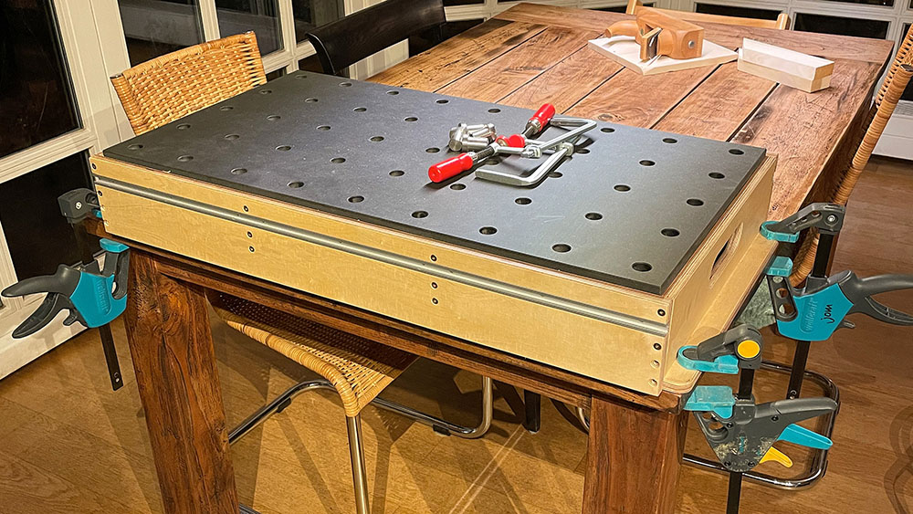

Maker Media GmbH

***

# 3-in-1-Werkbank

## Kompatibel zum 20mm-Festool-Lochraster

**Diese mobile Maker-Werkbank ist ein Multitalent: Befestigt man sie mit Schraubzwingen am Küchentisch, sorgt sie für eine angenehme Arbeitshöhe und bietet verschiedene Spannmöglichkeiten. Hängt man sie an die Wand, wird sie zum Werkzeugregal. Und dreht man sie um, verwandelt sie sich in eine Werkzeugkiste. Außerdem ist sie schnell und günstig gebaut.**

Hier gibt es die Materialliste, die Zuschnittliste, eine Explosionszeichnung sowie ein 3D-Modell aus SketchUp.

Der vollständige Artikel zum Projekt steht in der **[Make-Ausgabe 1/23 ab Seite 102](https://www.heise.de/select/make/2023/1/2220213363003207970)**.
